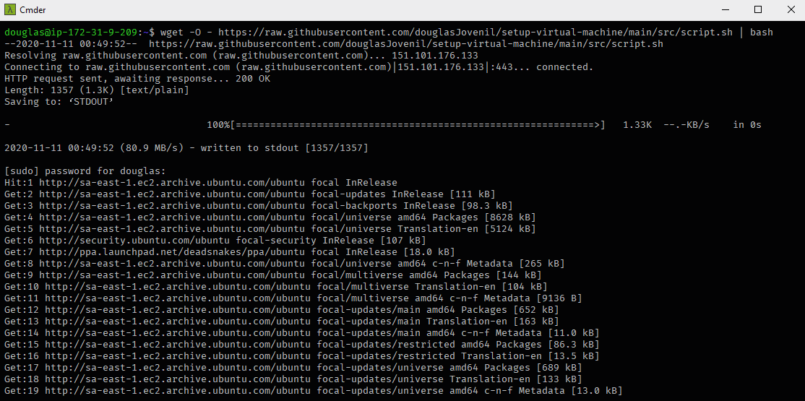
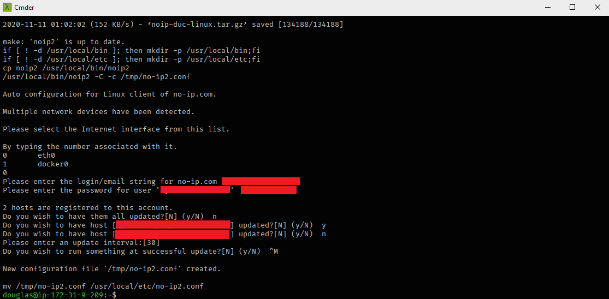
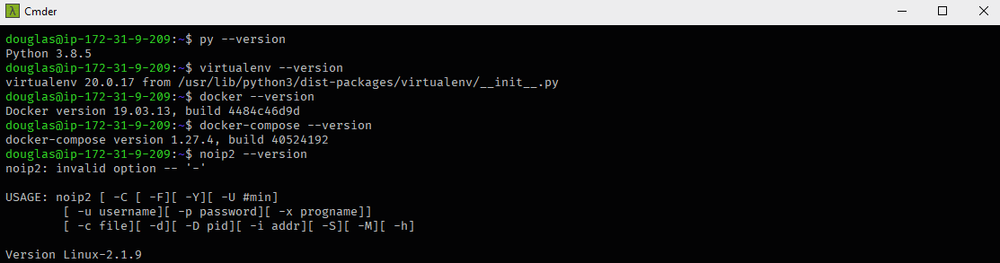

# Setup Virtual Machine

This script helps to automate the installation of the following applications on machine:

- [Python 3.8](https://www.python.org/downloads)
- [Virtualenv](https://virtualenv.pypa.io/en/latest)
- [Docker](https://www.docker.com)
- [Docker Compose](https://docs.docker.com/compose)
- [No-IP](https://www.noip.com)

## 💻 Project

#### Running Script



#### Script Done



#### Checking Softwares



## 🚀 Technologies

 Bash

## 🏃 Usage

```
bash <(curl -s https://raw.githubusercontent.com/douglasJovenil/setup-virtual-machine/main/src/script.sh)
```
